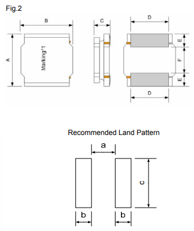

# gen_inductor.py
## Usage
`python gen_inductor.py <inputfile.yaml> <outputPath>`

## Intent
The goal was to easily copy and paste datasheet information for inductor series to generate the
appropriate footprints. In the specific case, Sunlord has a certain format (describe in CSV section below)
that did not suit the existing Inductor_SMD script format.

The workflow that has worked well for me is as follows
1. Use Foxit PDF to copy the specifications table.
1. Paste this in the spreadsheet editor of your choice
1. Delete the columns which aren't required
1. Rename the headers and perform any other editing or grouping required (eg. regex `# ±[\d\. ]*` is useful to match tolerances and delete)
1. Export to CSV format

## YAML input file
The yaml file is used to define all the series inputs. The `3d` section is needed if the file will be used with the the `kicad-packages3D-generator` script.

- series: Name of the series
- manufacturer: Name of the series
- datasheet: URL of the datasheet
- csv: Filename for the CSV file. Should not have a path prepended.
-   3d: Optional.
    - type: Optional. 
        * 1 - Rectangle body, rectangle pads on the bottom surface.
        * 2 - Rectangle body, rectangle pads on the bottom surface, with visible wings on the sides
        * 3 - Rectangle body with 4 heavy fillet (rounded) corners
    - bodyColor: Optional. Default to `black body`.
    - pinColor: Optional. Default to `metal grey pins`
    - padThickness: Optional. Default to `0.05` mm.
    - cornerRadius: Optional. Default to `2`mm. Corner radius used for type `3` above.
- tags: Optional. The word `inductor` as a tag is included already in the script. You should add the series name.
 

## CSV input files
The CSV format requires the following 6 columns, which can be in any order in the actual CSV file.

`PartNumber` - Part number that will be generated. This could be the unique part number,
or you can perform grouping if there are multiple parts sharing the same footprint.

`lengthY`, `widthX` and `height` - physical dimensions of the inductor.

`padX` and `padY` - the center of the pad

`padGap` - the gap between the copper pads. This can be center-to-center, or edge-to-edge (default). 
You should set the YAML file parameter accordingly based on what measurement the datasheet uses.

**Note** - you may need to swap the `length`/`width` values, and thus the `pad x`/`pad y` values.
The `lengthY` value should be the dimension/edge that shares the same side as the copper pads.

### Example

In this example from the SWPA series, the recommended land pattern is in the proper orientation (pads on the left/right) for this script.

- `b` becomes `padX`
- `c` is `padY`
- `a` is `padGap`.

In this datasheet, care must be taken to adjust the physical dimensions. `A` becomes `widthX` and `B` becomes `lengthY`,
since the land pattern is rotated to differ from the physical drawings.

